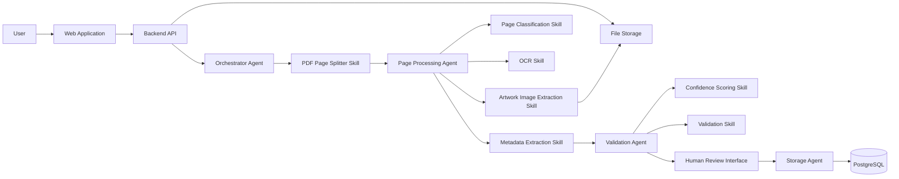

# High-Level Architecture Diagram

## What this shows

- The **user** uploads a catalogue through a simple web application.
- The **backend API** stores the file and starts the **Orchestrator Agent**.
- The Orchestrator Agent splits the PDF into pages and hands each page to
  the **Page Processing Agent**.
- The Page Processing Agent calls four Skills: page classification, OCR,
  artwork image extraction, and metadata extraction.
- The **Validation Agent** checks the result using the confidence scoring
  and validation Skills, then sends it to a human reviewer.
- Once approved, the **Storage Agent** saves the record in PostgreSQL.

Agents make decisions and coordinate the flow. Skills do one specific job
each and return a result. This separation is the core idea of the system.
