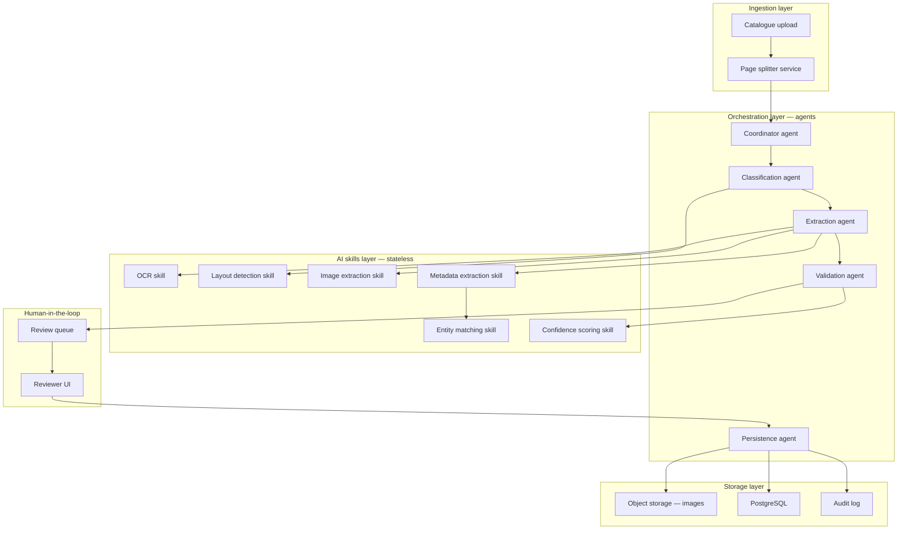

# High-Level Architecture

This diagram shows the four architectural layers of the system: ingestion,
agent orchestration, reusable AI skills, human-in-the-loop review, and
storage. Agents coordinate work and make decisions; skills are stateless
functions that do the actual computation. Neither layer talks directly to
storage except through the persistence agent, which keeps the write path
auditable and centralized.

## Layer responsibilities

**Ingestion layer** — accepts the uploaded PDF, validates it (file type,
page count, corruption check), and splits it into individual page images
plus extracted raw text layer (if the PDF has one) for downstream
processing.

**Orchestration layer (agents)** — coordinates *what happens and in what
order*, makes routing decisions (e.g. "does this page need human review?"),
and tracks the state of each page/entry through the pipeline. Agents do
not perform OCR, extraction, or scoring themselves — they call skills to
do that and act on the results.

**AI skills layer** — stateless, independently testable functions, each
doing one well-defined task. A skill takes an input and returns an
output; it holds no workflow state and doesn't know what happens next.
This is deliberate: skills can be reused across agents, swapped out
(e.g. replace the OCR skill's underlying engine) or scaled independently
of the orchestration logic.

**Human-in-the-loop layer** — a review queue and reviewer UI where a
curator inspects extracted records against the source image and
approves, corrects, or rejects them before anything is written to the
system of record.

**Storage layer** — PostgreSQL for structured metadata, object storage
(e.g. S3-compatible) for extracted artwork images, and an append-only
audit log capturing every human correction for traceability and future
model improvement.
