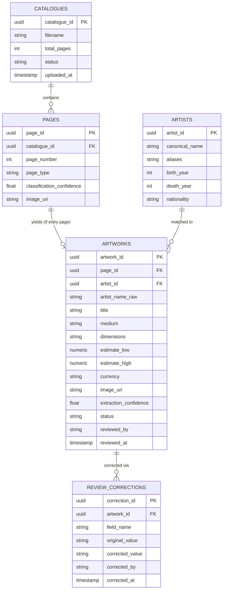

# Data Model — PostgreSQL

The schema separates four concerns: the source document (`catalogues`,
`pages`), the extracted business records (`artworks`), reference/master
data used for entity matching (`artists`), and the audit trail of human
corrections (`review_corrections`). Splitting artworks from artists
(rather than storing the artist name as a free-text field) is what
makes entity matching meaningful — extracted names are matched against
a canonical registry rather than trusted as-is.

## Notes on the schema

**`artist_name_raw` vs. `artist_id`.** The metadata extraction skill
produces whatever text it read off the page (`artist_name_raw`); the
entity matching skill then attempts to resolve that to a canonical
`artist_id` in the `ARTISTS` reference table. Both are kept — the raw
value for audit/debugging when matching goes wrong, the resolved ID for
any downstream querying or reporting by artist.

**`status` on both `PAGES` and `ARTWORKS`.** Pages have a coarse status
(entry vs. non-entry, or processing-failed); artworks have their own
status tracking where they are in the human review lifecycle
(`pending_review`, `approved`, `rejected`). This lets the system report
progress at both the page level ("48 of 50 pages processed") and the
record level ("12 of 15 extracted artworks approved").

**`REVIEW_CORRECTIONS` is intentionally granular (one row per field
correction, not one row per record).** This makes it possible to later
answer questions like "which extracted field is most often wrong —
dimensions or estimates?" which a single before/after snapshot per
record would not support, and which is valuable for deciding where to
invest in improving the metadata extraction skill.
