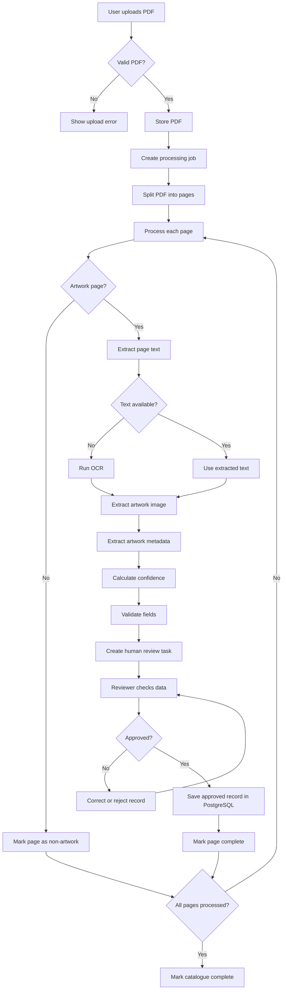

# End-to-End Workflow Diagram

## What this shows

Every page goes through the same path: check if it's an artwork page,
get the text (from the PDF directly, or OCR if needed), extract the
image, build the metadata, score confidence, validate, and send to a
human reviewer. Nothing is saved to PostgreSQL until a reviewer approves
it. The system keeps going through pages one at a time until the whole
catalogue is done.
