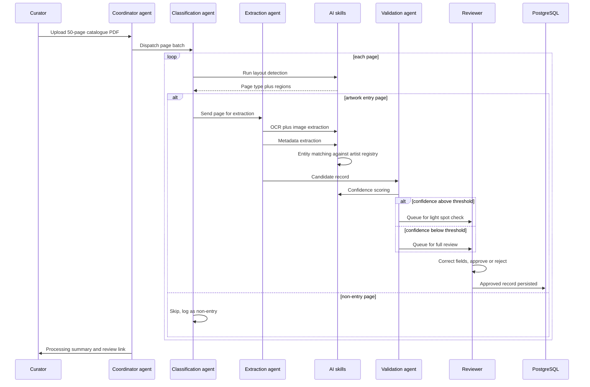

# End-to-End Workflow

This sequence diagram traces one 50-page catalogue through the entire
pipeline, from upload to a persisted record, including the two possible
paths a page can take (artwork entry vs. non-entry) and the two possible
review intensities a record can be routed to based on confidence.

## Notes on the workflow

**Why classification happens before extraction.** A 50-page catalogue
typically includes cover pages, table of contents, indices, and
advertisement pages alongside actual artwork entries. Running full
OCR/metadata extraction on every page regardless of type wastes
compute and pollutes the review queue with junk records. Classifying
first (a much cheaper operation — layout/structure detection rather
than full extraction) filters the page set down to only what's worth
extracting.

**Why confidence determines review depth, not whether review
happens.** Every record passes through human review before being
persisted — there is no fully automatic write path, given the
consequence of a wrong artist attribution or incorrect estimate in an
auction record. Confidence instead determines *how much* scrutiny a
record gets: a high-confidence record (clean OCR, exact artist-registry
match, all fields populated) goes to a lightweight spot-check queue;
a low-confidence record (poor scan quality, ambiguous artist name, missing
fields) goes to a full review queue with more of the original page image
surfaced for the reviewer to cross-reference.

**Where corrections go.** Every reviewer correction is logged (see the
audit log in the storage layer) — not just the final approved value.
This creates a dataset of "model got X, human corrected to Y" pairs,
which is the natural input for periodically evaluating and improving
the metadata extraction skill's prompt/model over time.
